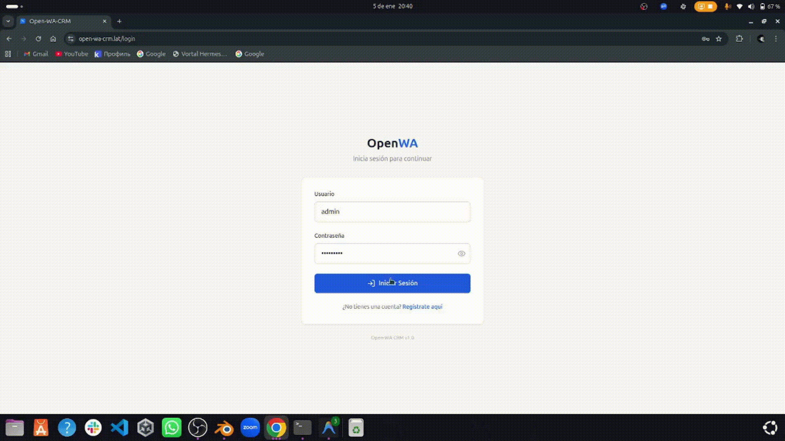
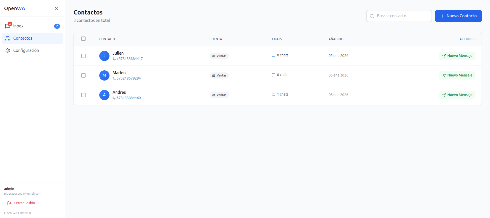
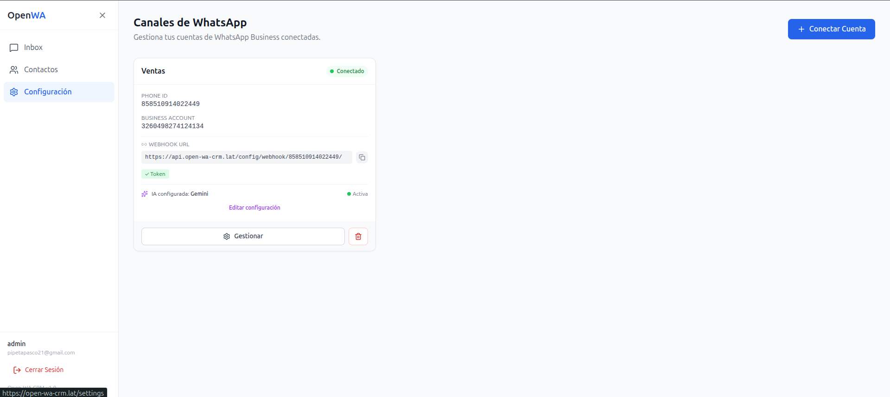
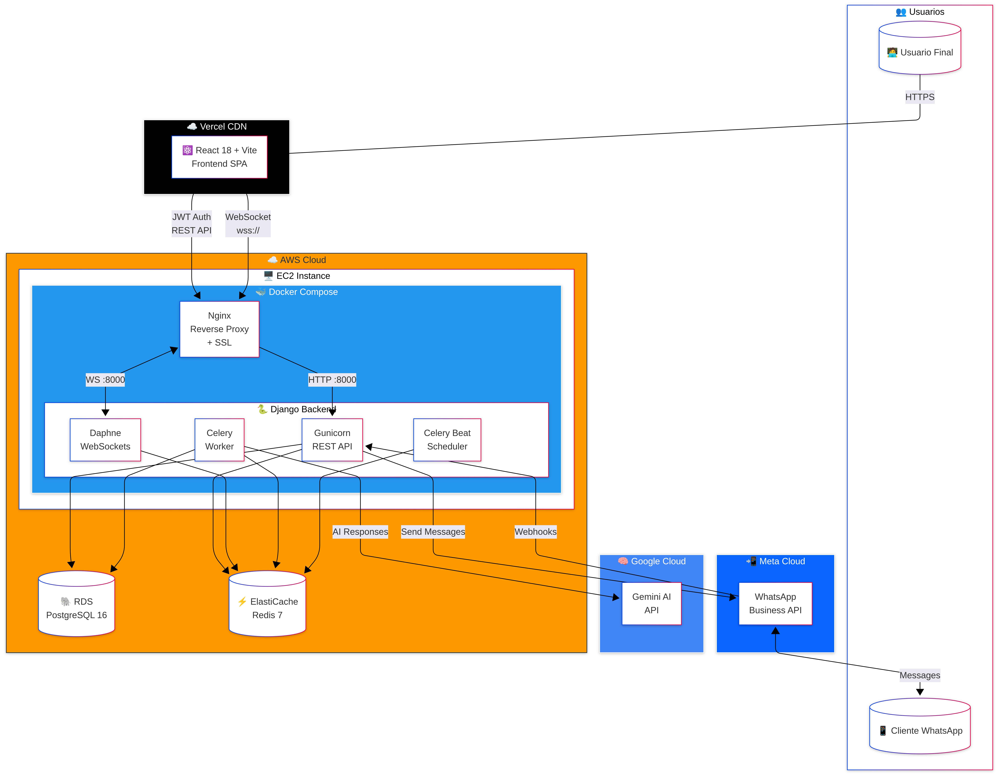
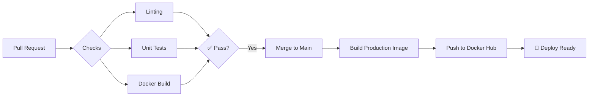

# OpenWa: CRM Multi-tenant con IA para WhatsApp 🚀

<p align="center">
  
</p>

<p align="center">
  
  
  
  
  
</p>

<p align="center">
  
  
  
  
  
</p>

<p align="center">
  
  
</p>

---

> **OpenWa** es una plataforma SaaS open-source diseñada para democratizar la atención al cliente con IA. Permite a cualquier usuario conectar su propia API de WhatsApp Business y su clave de Gemini AI para automatizar conversaciones, todo gestionado desde una infraestructura profesional en la nube.

🔗 **Demo en Vivo:** [https://open-wa-crm.lat](https://open-wa-crm.lat)  
*(La plataforma está activa y pública. ¡Regístrate y pruébala!)*

---

## 📸 Vista Previa

<p align="center">
  
</p>
<p align="center"><em>Dashboard principal con lista de contactos y estadísticas</em></p>

<br/>

<p align="center">
  
</p>
<p align="center"><em>Chat en tiempo real con respuestas automáticas de IA</em></p>

<br/>

<p align="center">
  
</p>
<p align="center"><em>Panel de configuración para conectar WhatsApp Business y Gemini AI</em></p>

<br/>

<details>
<summary>📱 <strong>Ver Vista Mobile</strong></summary>
<br/>
<p align="center">
  
</p>
<p align="center"><em>Diseño 100% responsive optimizado para móviles</em></p>
</details>

---

## 🏗️ Arquitectura de Infraestructura y Cloud

El sistema no es un monolito simple; utiliza una arquitectura híbrida y distribuida para maximizar el rendimiento y la escalabilidad.

<p align="center">
  
</p>

### 🌐 Frontend (Vercel)
- Desplegado en **Vercel** para aprovechar su CDN global y optimización de assets estáticos.
- Conecta con la API Backend mediante endpoints seguros protegidos por JWT.

### ☁️ Backend (AWS Ecosystem)
El núcleo del sistema corre en Amazon Web Services (AWS) utilizando una configuración de alta disponibilidad:

| Servicio | Tecnología | Descripción |
|----------|------------|-------------|
| **Compute** | EC2 + Docker | Backend Django en contenedores, orquestado con Docker Compose |
| **Web Server** | Nginx | Reverse Proxy para SSL, balanceo hacia Gunicorn (API) y Daphne (WebSockets) |
| **Database** | AWS RDS | PostgreSQL gestionado con backups automáticos y escalabilidad |
| **Cache & Broker** | AWS ElastiCache | Redis para caché, Message Broker de Celery y canales WebSocket |

---

## 🔄 CI/CD y Automatización (DevOps)

La calidad del código y el despliegue están garantizados mediante un pipeline de Integración y Despliegue Continuo (CI/CD) configurado en **GitHub Actions**.



### Flujo de Trabajo (Pipeline):

1. **Pull Request Check:**
   - Al abrir un PR, se dispara automáticamente una suite de pruebas.
   - **Linting:** Verificación de estilo de código con Ruff.
   - **Testing:** Ejecución de tests unitarios con pytest.
   - **Docker Build Check:** Verifica que la imagen pueda construirse correctamente.

2. **Continuous Deployment (CD):**
   - Al aprobarse el merge a `main`, el pipeline construye la imagen de producción.
   - Utilizando **GitHub Secrets** para seguridad, la imagen se sube a **Docker Hub**.
   - El servidor obtiene la última versión con `docker-compose pull`.

---

## ⚡ Características Destacadas

| Feature | Descripción |
|:-------:|-------------|
| 🔑 **BYOK (Bring Your Own Key)** | Los usuarios conectan sus propias APIs de WhatsApp Business y Gemini AI |
| 📨 **Templates de WhatsApp** | Envío masivo de plantillas pre-aprobadas por Meta |
| 🤖 **IA Conversacional** | Respuestas automáticas inteligentes con Google Gemini |
| ⚡ **Tiempo Real** | WebSockets para chat en vivo sin necesidad de recargar |
| 📱 **100% Responsive** | Funciona perfectamente en móvil y desktop |
| 🔒 **Multi-tenant** | Cada usuario tiene su data completamente aislada y segura |
| 🎨 **UI/UX Moderno** | Interfaz con glassmorphism, animaciones sutiles y dark mode |
| 📊 **Gestión de Contactos** | CRUD completo con búsqueda y filtros avanzados |

---

## 🛠️ Stack Tecnológico

<table>
  <tr>
    <td align="center" width="96">
      
      <br>Python 3.12
    </td>
    <td align="center" width="96">
      
      <br>Django 5.0
    </td>
    <td align="center" width="96">
      
      <br>React 18
    </td>
    <td align="center" width="96">
      
      <br>Vite
    </td>
    <td align="center" width="96">
      
      <br>TailwindCSS
    </td>
  </tr>
  <tr>
    <td align="center" width="96">
      
      <br>PostgreSQL
    </td>
    <td align="center" width="96">
      
      <br>Redis
    </td>
    <td align="center" width="96">
      
      <br>Docker
    </td>
    <td align="center" width="96">
      
      <br>AWS
    </td>
    <td align="center" width="96">
      
      <br>Nginx
    </td>
  </tr>
</table>

### Detalle Técnico:
- **Backend:** Python 3.12, Django 5.0, Django Rest Framework, Django Channels
- **Asincronía:** Celery (Tasks), Celery Beat (Scheduled Jobs), Redis
- **Frontend:** React 18, Vite, TailwindCSS, React Router
- **Base de Datos:** PostgreSQL 16 (AWS RDS)
- **Cache/Broker:** Redis 7 (AWS ElastiCache)
- **Infraestructura:** AWS (EC2, RDS, ElastiCache), Nginx, Docker, Vercel

---

## 🗺️ Roadmap

- [x] Integración con WhatsApp Business API
- [x] Respuestas automáticas con Gemini AI
- [x] Sistema de plantillas de WhatsApp
- [x] Chat en tiempo real con WebSockets
- [x] CI/CD con GitHub Actions
- [ ] Dashboard de Analytics y métricas
- [ ] Integración con más LLMs (OpenAI, Claude)
- [ ] Exportación de conversaciones a CSV/PDF
- [ ] Webhooks personalizados para integraciones
- [ ] Sistema de etiquetas para contactos
- [ ] Soporte multi-idioma (i18n)

---

## 🚀 Instalación Local (Desarrollo)

Si deseas levantar el proyecto en tu máquina local para contribuir:

### Prerequisitos
- Docker y Docker Compose
- Node.js 18+ y npm
- Git

### Backend

1. **Clonar y configurar:**
   ```bash
   git clone https://github.com/pipetapasco/Open-WA-CRM.git
   cd Open-WA-CRM
   cp backend/.env.example backend/.env
   ```

2. **Levantar con Docker Compose:**
   ```bash
   docker-compose up --build
   ```
   *Esto iniciará localmente los servicios simulando el entorno de producción (Postgres y Redis en contenedores locales).*

### Frontend

3. **Instalar dependencias:**
   ```bash
   cd frontend
   npm install
   ```

4. **Configurar Variables de Entorno:**
   Crea un archivo `.env` en la carpeta `frontend/`:
   ```env
   VITE_API_URL=http://localhost:8000/api
   VITE_WS_URL=ws://localhost:8000/ws
   ```

5. **Iniciar Servidor de Desarrollo:**
   ```bash
   npm run dev
   ```
   - La aplicación estará disponible en: `http://localhost:5173`

6. **Build para Producción (Opcional):**
   ```bash
   npm run build
   npm run preview
   ```

---

## 🤝 Contribuciones

¡Las contribuciones son bienvenidas! Si deseas contribuir:

1. Fork el proyecto
2. Crea tu Feature Branch (`git checkout -b feature/AmazingFeature`)
3. Commit tus cambios (`git commit -m 'Add: AmazingFeature'`)
4. Push a la Branch (`git push origin feature/AmazingFeature`)
5. Abre un Pull Request

---

## 📄 Licencia

Distribuido bajo la Licencia MIT. Ver `LICENSE` para más información.

---

## 👤 Autor

<p align="center">
  
</p>

<h3 align="center">Andrés Felipe Tapasco Garzón</h3>
<p align="center"><em>Full Stack Developer & Systems Engineer</em></p>

<p align="center">
  <a href="https://www.linkedin.com/in/andres-felipe-tapasco-garzon-59b24624b">
    
  </a>
  <a href="https://github.com/pipetapasco">
    
  </a>
  <a href="mailto:pipetapasco@gmail.com">
    
  </a>
</p>

---

<p align="center">
  <strong>⭐ Si este proyecto te resultó útil, considera darle una estrella en GitHub ⭐</strong>
</p>

<p align="center">
  Made with ❤️ and ☕ in Colombia 🇨🇴
</p>